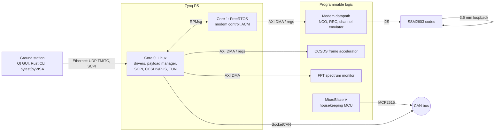

# SatLink-Z7

[](https://github.com/Asvasist/satlink-z7/actions/workflows/ci.yml)
[](docs/stages/stage-1.md)
[](LICENSE)

**A software-defined satellite payload and ground link, built end-to-end on a single Zynq-7020
board — three processors, a real modulated signal, and the same engineering process a flight
software team would use.**

SatLink-Z7 turns a Digilent Zybo Z7-20 into a miniature communications payload with a ground
segment talking to it over Ethernet. It exists to demonstrate, in one coherent system rather than
a pile of disconnected demos, the full stack an embedded/firmware/driver engineer is expected to
own: RTOS tasking, Linux kernel drivers, AMP between heterogeneous cores, bus protocols
(SPI/I2C/I2S/CAN/UART), DMA, custom digital logic, bootloaders and signed/fallback boot images,
and a C++/Qt ground tool — all wired together and verified against written requirements instead
of demoed in isolation.

## Why this exists

Most portfolio projects show one slice of embedded work — a blinky RTOS demo, a Linux driver, a
Qt GUI. Flight and payload software teams need engineers who can move across that whole stack and
reason about how the pieces fit: what runs on which core, who owns which interrupt, what happens
when a boot image is corrupt, how a requirement traces to the test that verifies it. SatLink-Z7 is
built as one system, with the discipline (requirements, ICD, ADRs, CI, traceability) that a real
payload development process uses — scaled down to something one person can build and demonstrate
on a single board.

## System overview

Three processors on one chip, each with exclusive ownership of its own resources:

| Processor | Software | Role |
|---|---|---|
| Cortex-A9 Core 0 | Embedded Linux (Yocto, PREEMPT_RT) | Payload manager, kernel drivers, CCSDS/PUS telemetry & telecommand, SCPI server, networking |
| Cortex-A9 Core 1 | FreeRTOS (AMP via OpenAMP/RPMsg) | Hard-real-time modem control, adaptive coding and modulation (ACM), frame timing |
| MicroBlaze V (soft core, in the PL) | Bare-metal, own bootloader | Housekeeping: temperatures, voltages, watchdog, CAN bus |

The programmable logic (PL) hosts a baseband modem (NCOs, RRC pulse-shaping filters, a channel
emulator for injecting noise), a CCSDS frame accelerator, and an FFT-based spectrum monitor. The
"RF" link is real, not simulated: a 3.5 mm cable from the board's headphone output to its line
input carries an actual modulated carrier (12 kHz, 6 kSym/s) through the on-board audio codec, so
modulation, synchronization, noise and adaptive coding all happen on physical signals rather than
a software mock.



A ground station on the PC (Qt/C++ GUI, plus a CLI and pytest/pyVISA hardware-in-the-loop tests)
sends telecommands, plots live telemetry, and shows the constellation diagram and bit-error rate
as the link adapts.

## Skills this project demonstrates

| Area | Where |
|---|---|
| RTOS design (FreeRTOS) | Modem control, ACM state machine, task timing on Core 1 — Stage 4 |
| Embedded Linux (Yocto/PREEMPT_RT) | `yocto/meta-satlink` BSP layer, kernel config, image recipe — Stage 1 |
| Linux kernel driver development | Platform drivers with device-tree bindings, char devices, IRQ + `dmaengine` DMA — Stage 2 |
| AMP / heterogeneous multicore | OpenAMP + RPMsg between Linux (Core 0) and FreeRTOS (Core 1) — Stage 4 |
| Bus protocols: SPI, I2C, I2S, UART, CAN | MCP2515 CAN over SPI, SSM2603 codec over I2C, I2S audio, debug UART consoles — Stages 2–3 |
| DMA and custom digital logic | AXI DMA to/from the modem, frame accelerator and FFT block; RTL in `hw/rtl` | 
| Bootloaders and boot images | FSBL, U-Boot, A/B image scheme with CRC/signature check and golden-image fallback — Stages 1 & 5 |
| C / C++ (C11, C++20) | `libs/common` (portable C11), C++20 HAL and payload manager, MISRA-oriented static analysis |
| Qt / cross-platform GUI | Ground station on Windows and Linux — Stage 6 |
| CI/CD, testing, traceability | GitHub Actions, Unity/GoogleTest, coverage, clang-tidy/cppcheck, StrictDoc SRS with a generated traceability matrix |

## Repository layout

```
cmake/           toolchain files (arm-linux-gnueabihf, arm-none-eabi, riscv) and CMake modules
docs/            architecture (arc42 + ADRs), ICD, requirements, traceability, bring-up reports
firmware/rtos/   FreeRTOS firmware for Core 1                                  (Stage 4)
firmware/hkc/    MicroBlaze V housekeeping firmware and bootloader             (Stage 3)
host/            ground station (Qt), Rust CLI, HIL tests                      (Stage 6)
hw/              Vivado block design Tcl, RTL, constraints, filter coefficients
icd/             interface control: address map and register maps (YAML)
libs/common/     portable C11 library (CRC-16, CCSDS randomizer, ...)
libs/regs/       generated register headers (C and C++)
linux/           kernel drivers, C++ HAL, payload manager                      (Stage 2)
tests/           unit tests
tools/           register-map generator, traceability matrix
yocto/           kas configuration, meta-satlink BSP layer, QEMU smoke test, BOOT.BIN recipe
```

## Engineering practices

- **One build for four targets.** CMake presets for host, Linux (Core 0), FreeRTOS (Core 1)
  and MicroBlaze V (RV32). See [ADR-0001](docs/architecture/adr/0001-one-cmake-build.md).
- **Interfaces as code.** Register maps, base addresses, interrupts and DDR partitions live in
  YAML under [`icd/`](icd/). C/C++ headers and the [ICD pages](docs/icd/generated/README.md) are
  generated and validated; CI fails when they drift. See
  [ADR-0002](docs/architecture/adr/0002-icd-yaml-single-source.md).
- **Requirements traceability.** [SRS](docs/requirements/satlink_srs.sdoc) in StrictDoc
  (exportable to ReqIF for DOORS), `@implements`/`@verifies` tags in code, and a generated
  [traceability matrix](docs/traceability/traceability.md).
- **Shift-left testing.** Unity (C) and GoogleTest (C++) unit tests, coverage gate, ASan/UBSan,
  clang-tidy, cppcheck with a MISRA C:2012 report, QEMU boot test, and later hardware-in-the-loop
  tests with pytest/pyVISA.
- **Reference models first.** The C library in `libs/common` is the bit-exact reference the
  FPGA blocks and drivers are verified against.

## Roadmap

| Stage | Content | Status |
|---|---|---|
| 1 | Foundation and BSP: build system, CI, requirements, ICD, Yocto layer, boot | **in progress** |
| 2 | Linux drivers, C++ HAL, diagnostics, board bring-up | planned |
| 3 | Housekeeping MCU, CAN bootloader, secure A/B boot | planned |
| 4 | AMP and real-time modem (FreeRTOS, FEC, synchronization) | planned |
| 5 | Adaptive link (ACM, LEO pass emulation) and on-board networking | planned |
| 6 | SCPI server, Qt ground station, Rust CLI, HIL tests, performance report | planned |

Stage 1 exit criteria and checklist: [docs/stages/stage-1.md](docs/stages/stage-1.md).
Full architecture (arc42 + ADRs): [docs/architecture](docs/architecture/README.md).

## Project status

Stage 1 is in progress:

- [x] Repository layout, license, contribution rules, `.gitignore`
- [x] CMake build with host/linux/rtos/hkc presets, CI workflow written
- [x] SRS (StrictDoc), arc42 architecture doc, ADRs, ICD address/register maps
- [x] Reference library (`libs/common`: CRC-16-CCITT, CCSDS randomizer) with unit tests
- [x] Yocto `meta-satlink` BSP layer and `kas` configuration written
- [ ] First local host build + unit test run (in progress)
- [ ] Repository pushed and public, CI green
- [ ] First Yocto image built and booted (QEMU, then hardware)
- [ ] Vivado `hw-v1` block design exported, board bring-up report

## Hardware

Digilent Zybo Z7-20, 2x Digilent PmodCAN, 2x 3.3 V USB-UART adapters, 3.5 mm audio cable,
twisted pair with 120 Ω terminations. Pin-out and wiring: [hw/README.md](hw/README.md).

## Quick start

Linux or WSL2 (Ubuntu 24.04):

```bash
sudo apt install cmake ninja-build gcc g++ python3-venv
python3 -m venv ~/.venvs/satlink && source ~/.venvs/satlink/bin/activate   # Ubuntu 24.04: no global pip

cmake --preset host-debug && cmake --build --preset host-debug && ctest --preset host-debug

pip install -r tools/requirements.txt
python3 -m pytest tools                      # generator and traceability tool tests
python3 tools/regmap/regmap_gen.py --check   # generated headers match icd/
python3 tools/trace/trace_matrix.py --check  # traceability matrix is current
```

Cross builds (install the matching toolchain first):

```bash
cmake --preset linux-arm && cmake --build --preset linux-arm   # gcc-arm-linux-gnueabihf
cmake --preset rtos-a9   && cmake --build --preset rtos-a9     # gcc-arm-none-eabi
cmake --preset hkc-riscv && cmake --build --preset hkc-riscv   # gcc-riscv64-unknown-elf
```

Linux image: see [yocto/README.md](yocto/README.md).

## License

MIT, see [LICENSE](LICENSE).
