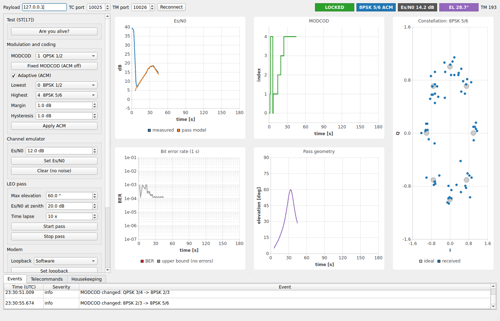

# SatLink-Z7

[](https://github.com/Asvasist/satlink-z7/actions/workflows/ci.yml)
[](docs/stages/stage-6.md)
[](LICENSE)

**A software-defined satellite payload and ground link, built end-to-end on a single Zynq-7020
board — three processors, a real modulated signal, and the same engineering process a flight
software team would use.**

SatLink-Z7 turns a Digilent Zybo Z7-20 into a miniature communications payload with a ground
segment talking to it over Ethernet. It exists to demonstrate, in one coherent system rather than
a pile of disconnected demos, the full stack an embedded/firmware/driver engineer is expected to
own: RTOS tasking, Linux kernel drivers, AMP between heterogeneous cores, bus protocols
(SPI/I2C/I2S/CAN/UART), DMA, custom digital logic, bootloaders and signed/fallback boot images,
and a C++/Qt ground tool — all wired together and verified against written requirements instead
of demoed in isolation.

## Why this exists

Most portfolio projects show one slice of embedded work — a blinky RTOS demo, a Linux driver, a
Qt GUI. Flight and payload software teams need engineers who can move across that whole stack and
reason about how the pieces fit: what runs on which core, who owns which interrupt, what happens
when a boot image is corrupt, how a requirement traces to the test that verifies it. SatLink-Z7 is
built as one system, with the discipline (requirements, ICD, ADRs, CI, traceability) that a real
payload development process uses — scaled down to something one person can build and demonstrate
on a single board.

## System overview

Three processors on one chip, each with exclusive ownership of its own resources:

| Processor | Software | Role |
|---|---|---|
| Cortex-A9 Core 0 | Embedded Linux (Yocto, PREEMPT_RT) | Payload manager, kernel drivers, CCSDS/PUS telemetry & telecommand, SCPI server, networking |
| Cortex-A9 Core 1 | FreeRTOS (AMP: own loader driver, shared-memory IPC) | Hard-real-time modem control, adaptive coding and modulation (ACM), frame timing |
| MicroBlaze V (soft core, in the PL) | Bare-metal, own bootloader | Housekeeping: temperatures, voltages, watchdog, CAN bus |

The programmable logic (PL) hosts a baseband modem (NCOs, RRC pulse-shaping filters, a channel
emulator for injecting noise), a CCSDS frame accelerator, and an FFT-based spectrum monitor. The
"RF" link is real, not simulated: a 3.5 mm cable from the board's headphone output to its line
input carries an actual modulated carrier (12 kHz, 6 kSym/s) through the on-board audio codec, so
modulation, synchronization, noise and adaptive coding all happen on physical signals rather than
a software mock.


A ground station on the PC (Qt/C++ GUI, plus a Rust CLI, a Python library and pytest/pyVISA
hardware-in-the-loop tests) sends telecommands, plots live telemetry, and shows the constellation
diagram and bit-error rate as the link adapts. Telemetry reaches it only through the modem link,
so fades and loss of signal hit the ground exactly as a real downlink would.



*The ground station during an emulated 60° pass (10× time lapse) against the payload daemon in
simulation mode: ACM climbs from BPSK 1/2 to 8PSK 5/6 as the elevation rises.*

## Skills this project demonstrates

| Area | Where |
|---|---|
| RTOS design (FreeRTOS) | Modem control, ACM state machine, task timing on Core 1 — Stage 4 |
| Embedded Linux (Yocto/PREEMPT_RT) | `yocto/meta-satlink` BSP layer, kernel config, image recipe — Stage 1 |
| Linux kernel driver development | Platform drivers with device-tree bindings, char devices, IRQ + `dmaengine` DMA — Stage 2 |
| AMP / heterogeneous multicore | Linux driver that loads and supervises FreeRTOS on Core 1, lock-free shared-memory IPC, MMU-enforced isolation — Stage 4 |
| Bus protocols: SPI, I2C, I2S, UART, CAN | MCP2515 CAN over SPI, SSM2603 codec over I2C, I2S audio, debug UART consoles — Stages 2–3 |
| DMA and custom digital logic | AXI DMA to/from the modem, frame accelerator and FFT block; RTL in `hw/rtl` |
| Bootloaders and boot images | FSBL, U-Boot, signed FIT A/B scheme with boot counter and golden-image fallback, CAN bootloader for the soft core — Stages 1 & 3 |
| C / C++ (C11, C++20) | `libs/common` (portable C11), C++20 HAL and payload manager, MISRA-oriented static analysis |
| Qt / cross-platform GUI | Ground station on Windows and Linux (Qt 6 Widgets + Charts) — Stage 6 |
| Signal processing and link engineering | Software modem (K=7 Viterbi, PSK up to 8PSK, Gardner timing, PLL), ACM, LEO pass link budget, [measured performance report](docs/performance/README.md) — Stages 4–6 |
| Space protocols | CCSDS space packets, PUS-C services, TM transfer frames with virtual channels, IP over the link — Stage 5 |
| Test automation and instrument control | SCPI-1999 server, pytest/pyVISA HIL suite running against the board or a simulator — Stage 6 |
| FDIR | Core 1 heartbeat restart, systemd service watchdog, SoC watchdog, A/B rollback — [docs/fdir](docs/fdir/README.md) |
| CI/CD, testing, traceability | GitHub Actions, Unity/GoogleTest, coverage, clang-tidy/cppcheck, StrictDoc SRS with a generated traceability matrix |

## Repository layout

```
cmake/           toolchain files (arm-linux-gnueabihf, arm-none-eabi, riscv) and CMake modules
docs/            architecture (arc42 + ADRs), ICD, requirements, traceability, bring-up reports
firmware/rtos/   FreeRTOS firmware for Core 1                                  (Stage 4)
firmware/hkc/    MicroBlaze V housekeeping firmware and bootloader             (Stage 3)
host/            ground station (Qt), Rust CLI, Python client, HIL tests       (Stage 6)
hw/              Vivado block design Tcl, RTL, constraints, filter coefficients
icd/             interface control: address map and register maps (YAML)
libs/common/     portable C11 library (CRC-16, CCSDS randomizer, ...)
libs/regs/       generated register headers (C and C++)
libs/modem/      software modem: FEC, mapping, framing, receiver, channel model (Stage 4)
libs/modem_app/  Core 1 modem application; libs/acm: adaptive coding and modulation
libs/amp/        inter-core rings and messages; libs/hkc_proto, libs/mcp2515: housekeeping CAN
libs/pus/        CCSDS space packets, PUS-C, TM transfer frames (Stage 5)
libs/scpi/       SCPI-1999 / IEEE 488.2 parser (Stage 6)
linux/           kernel drivers, HAL, tools, AMP client, payload manager      (Stages 2-5)
tests/           unit tests
tools/           register-map generator, traceability matrix, modem performance sweep
yocto/           kas configuration, meta-satlink BSP layer, QEMU smoke test, BOOT.BIN recipe
```

## Engineering practices

- **One build for four targets.** CMake presets for host, Linux (Core 0), FreeRTOS (Core 1)
  and MicroBlaze V (RV32). See [ADR-0001](docs/architecture/adr/0001-one-cmake-build.md).
- **Interfaces as code.** Register maps, base addresses, interrupts and DDR partitions live in
  YAML under [`icd/`](icd/). C/C++ headers and the [ICD pages](docs/icd/generated/README.md) are
  generated and validated; CI fails when they drift. See
  [ADR-0002](docs/architecture/adr/0002-icd-yaml-single-source.md).
- **Requirements traceability.** [SRS](docs/requirements/satlink_srs.sdoc) in StrictDoc
  (exportable to ReqIF for DOORS), `@implements`/`@verifies` tags in code, and a generated
  [traceability matrix](docs/traceability/traceability.md).
- **Shift-left testing.** Unity (C) and GoogleTest (C++) unit tests, coverage gate, ASan/UBSan,
  clang-tidy, cppcheck with a MISRA C:2012 report, the Core 1 firmware self-test in QEMU, kernel
  modules built against linux-xlnx with `W=1 -Werror`, and a pytest/pyVISA hardware-in-the-loop
  suite that runs in CI against the payload daemon in simulation mode.
- **Measure, then set parameters.** The ACM switching thresholds come from a link performance
  sweep of the modem code itself. CI repeats the sweep and fails if a threshold is ever below
  what the modem needs ([performance report](docs/performance/README.md)).
- **Reference models first.** The C library in `libs/common` is the bit-exact reference the
  FPGA blocks and drivers are verified against.

## Roadmap and status

The software of all six stages is written and verified on the host (unit tests, QEMU,
simulation). What remains is the hardware: the Vivado block design (hw-v1, then hw-v2 with the
modem datapath) and bring-up on the board. Every stage page ends with its checklist for the
board.

| Stage | Content | Status |
|---|---|---|
| 1 | Foundation and BSP: build system, CI, requirements, ICD, Yocto layer, boot | software done; first image and boot need the hw-v1 XSA ([details](docs/stages/stage-1.md)) |
| 2 | Linux drivers, C++ HAL, diagnostics | software done, modules build against linux-xlnx 6.6; bring-up pending ([details](docs/stages/stage-2.md)) |
| 3 | Housekeeping MCU, CAN bootloader, secure A/B boot | software done; hardware pending ([details](docs/stages/stage-3.md)) |
| 4 | AMP and real-time modem (FreeRTOS, FEC, synchronisation) | software done, firmware self-test passes in QEMU; board pending ([details](docs/stages/stage-4.md)) |
| 5 | Adaptive link (ACM, LEO pass emulation), PUS services, IP over the link | software done, runs in simulation; board pending ([details](docs/stages/stage-5.md)) |
| 6 | SCPI server, Qt ground station, Rust CLI, HIL tests, performance report, FDIR | software done, HIL suite passes against the simulator; board run pending ([details](docs/stages/stage-6.md)) |

### Verification summary

| Check | Result |
|---|---|
| Host unit tests (C and C++, GoogleTest/Unity) | 254 pass; also under ASan/UBSan |
| Line coverage of `libs/` | above the 80 % gate |
| Cross builds: Linux (arm-linux-gnueabihf), FreeRTOS (arm-none-eabi), MicroBlaze V (rv32) | build with `-Werror` |
| Kernel modules and device trees against linux-xlnx 6.6 | build with `W=1 -Werror` |
| Core 1 firmware in QEMU (`tools/rtos/qemu_selftest.py`) | SELFTEST PASS, including the MMU ownership check |
| HIL suite, `--target sim` (PUS over UDP, SCPI over pyVISA) | 27 pass, 4 board-only skipped |
| Rust CLI (fmt, clippy `-D warnings`, tests) | 13 pass |
| Python client and tool tests | pass |
| Link performance: every ACM threshold ≥ measured 1 % FER point | holds, margins 0.5 to 0.8 dB |
| Requirements traceability | every tag resolves; matrix up to date |
| On the board | pending: see the checklists on the stage pages and in [docs/fdir](docs/fdir/README.md) |

CI (`.github/workflows/ci.yml`) runs all of the above on pushes to `main` and on pull requests.
It also builds the ground station on Linux and Windows and the CLI on both.

Architecture (arc42 + ADRs): [docs/architecture](docs/architecture/README.md). Interfaces:
[ICD](docs/icd/README.md). Requirements: [SRS](docs/requirements/satlink_srs.sdoc) and
[traceability matrix](docs/traceability/traceability.md).

## Hardware

Digilent Zybo Z7-20, 2x Digilent PmodCAN, 2x 3.3 V USB-UART adapters, 3.5 mm audio cable,
twisted pair with 120 Ω terminations. Pin-out and wiring: [hw/README.md](hw/README.md).

## Quick start

Linux or WSL2 (Ubuntu 24.04):

```bash
sudo apt install cmake ninja-build gcc g++ python3-venv
python3 -m venv ~/.venvs/satlink && source ~/.venvs/satlink/bin/activate   # Ubuntu 24.04: no global pip

cmake --preset host-debug && cmake --build --preset host-debug && ctest --preset host-debug

pip install -r tools/requirements.txt
python3 -m pytest tools                      # generator, traceability and performance tool tests
python3 tools/regmap/regmap_gen.py --check   # generated headers match icd/
python3 tools/trace/trace_matrix.py --check  # traceability matrix is current
```

### The whole system without a board

`satlink-payloadd --sim` runs the Core 1 modem firmware logic in-process, with the software
loopback in place of the RF path. Everything else is the real payload manager.

```bash
cmake --preset host-release && cmake --build --preset host-release
build/host-release/linux/payload/satlink-payloadd --sim --verbose &

# Ground station (needs qt6-base-dev and qt6-charts-dev)
cmake -S host/gs -B build/gs && cmake --build build/gs
build/gs/satlink-gs --pass --constellation

# Command line and SCPI
(cd host/cli && cargo build --release) && host/cli/target/release/satlink ping
printf '*IDN?\nCHAN:ESN0 9;:MEAS:ESN0?\n' | nc -q1 localhost 5025

# Hardware-in-the-loop suite against the simulator (starts its own daemon)
pip install -r host/hil/requirements.txt && pytest host/hil --target sim

# Link performance sweep and report
build/host-release/tools/perf/satlink-modem-perf --frames 500 > perf.csv
python3 tools/perf/plot_perf.py perf.csv --out build/performance --check
```

Cross builds (install the matching toolchain first):

```bash
cmake --preset linux-arm && cmake --build --preset linux-arm   # gcc-arm-linux-gnueabihf
cmake --preset rtos-a9   && cmake --build --preset rtos-a9     # gcc-arm-none-eabi
cmake --preset hkc-riscv && cmake --build --preset hkc-riscv   # gcc-riscv64-unknown-elf
```

Linux image: see [yocto/README.md](yocto/README.md). Host tools on Windows:
[host/README.md](host/README.md).

## License

MIT, see [LICENSE](LICENSE).
