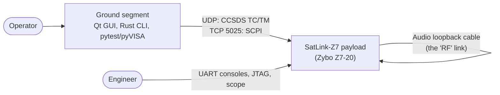
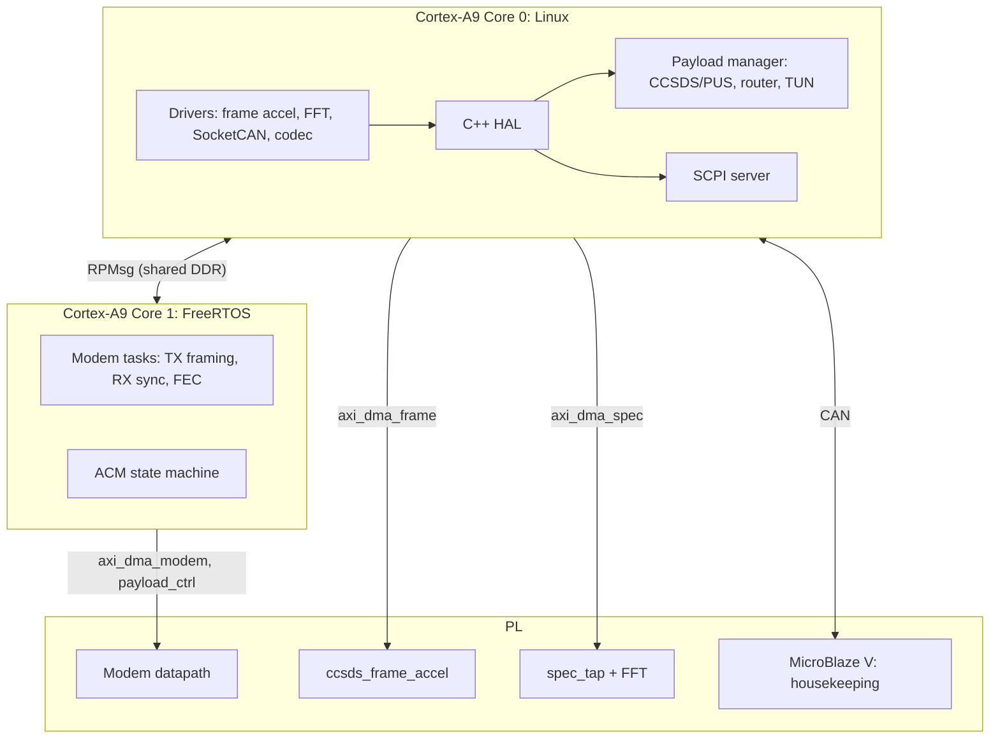

# SatLink-Z7 architecture

Structure follows [arc42](https://arc42.org) (condensed). Decisions are recorded as ADRs in
[adr/](adr/). Interfaces are specified in the [ICD](../icd/README.md).

## 1. Goals and constraints

| Goal | Measure |
|---|---|
| Realistic payload software architecture | Three processors with exclusive resource ownership (SRS-SYS-001/002) |
| Physical signal path | Modulated carrier through the audio codec and a 3.5 mm cable |
| Verifiable | Every accepted requirement traced to code and to an automated test |
| Reproducible | One CMake build, pinned Yocto layers, CI on every push |

Constraints: one Zynq-7020 (2x Cortex-A9 at 667 MHz, 85k logic cells, 1 GiB DDR3L), audio-band
"RF" (48 kHz sample rate), no real antenna.

## 2. Context

## 3. Deployment (who runs where)

Ownership of every peripheral, interrupt and DDR region: [address map](../icd/generated/address_map.md).

## 4. Building blocks (software)

| Block | Language | Target | Stage |
|---|---|---|---|
| `libs/common` | C11, no malloc, no OS | all | 1 |
| `libs/regs` (generated) | C / C++20 | all | 1 |
| Linux platform drivers | C (kernel) | linux | 2 |
| HAL (`satlink::hal`) | C++20 | linux | 2 |
| MCU firmware + bootloader | C11 | hkc | 3 |
| Modem firmware | C11 | rtos | 4 |
| Payload manager | C++20 | linux | 5 |
| SCPI server | C++20 | linux | 6 |
| Ground station / CLI / HIL tests | C++/Qt, Rust, Python | host | 6 |

## 5. Cross-cutting concepts

- **Error handling (C):** functions return `satlink_status_t`; no dynamic memory in firmware.
- **Register access:** only through generated headers; never raw offsets in code.
- **Reference models:** every PL datapath has a C or MATLAB golden model with unit tests.
- **Time:** Linux is the time master; FreeRTOS and the MCU receive time via RPMsg/CAN (Stage 4).
- **Logging:** Linux uses journald; FreeRTOS and MCU log to their UART consoles.

## 6. Decisions

| ADR | Title |
|---|---|
| [0001](adr/0001-one-cmake-build.md) | One CMake build for all targets |
| [0002](adr/0002-icd-yaml-single-source.md) | ICD YAML files are the single source of truth |
| [0003](adr/0003-amp-resource-ownership.md) | AMP with exclusive resource ownership |
| [0004](adr/0004-stage1-boot-chain.md) | Stage 1 boot chain: FSBL from Vitis, U-Boot and Linux from Yocto |
