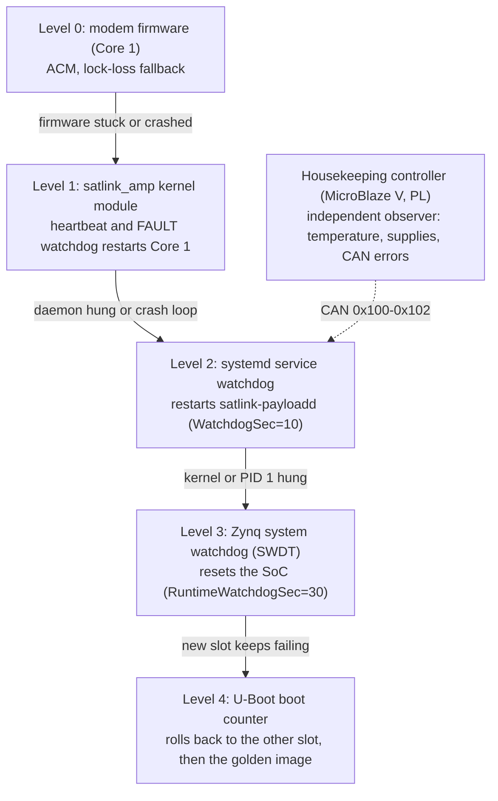

# Fault detection, isolation and recovery (FDIR)

Every fault is handled at the lowest level that can recover from it. A level escalates only when
its own recovery fails. Each level is watched by an independent mechanism: one that runs on
different hardware, or at least in a different privilege domain.

| Level | Fault | Detection | Isolation | Recovery | Reported as | Requirement |
|---|---|---|---|---|---|---|
| 0 | Fade, loss of lock | Receiver: no CRC-good frame for two frame times | Link layer only | ACM drops to the lowest MODCOD, then climbs back. Telemetry is stored and forwarded. | ST[05] *link lost* / *link locked*, *MODCOD changed* | SRS-ACM-001, SRS-PLM-001 |
| 0 | Frame lost to bit errors | CRC-16 of the frame, sequence gap on the virtual channel | Frame demultiplexer | Resynchronise on the next first-header pointer. No retransmission. | Link HK (SID 2): lost frames, resyncs | SRS-PUS-002 |
| 1 | Core 1 firmware crash (data abort, undefined instruction, assertion) | Fault handler writes a FAULT record to shared memory. The kernel module sees state FAULT. | MMU: Core 1 cannot touch Linux memory (ADR-0005) | Kernel module resets Core 1 through the SLCR and reloads the firmware (`auto_restart`) | Platform HK (SID 3): Core 1 state, restart count | SRS-AMP-005 |
| 1 | Core 1 hang (no fault report) | Heartbeat counter unchanged for 3 s | as above | as above | as above | SRS-AMP-005 |
| 2 | `satlink-payloadd` crash | systemd sees the process exit | Separate process | `Restart=on-failure` after 2 s | Journal. The ground sees a telemetry gap. | SRS-FDIR-002 |
| 2 | `satlink-payloadd` hang | `WATCHDOG=1` missing for 10 s (the daemon pings from its main loop every 5 s) | as above | systemd sends SIGABRT (core dump), then restarts the service | as above | SRS-FDIR-002 |
| 2 | Crash loop | 5 restarts within 60 s (`StartLimitBurst`) | as above | Service stays down. On a trial boot slot `satlink-boot-ok` does not confirm, which leads to level 4. | Journal, boot counter | SRS-FDIR-002, SRS-BOOT-002 |
| 3 | Kernel or PID 1 hang | systemd stops feeding the SWDT for 30 s | Hardware timer in the PS, independent of both CPUs | SoC reset (`reset-on-timeout`) | `bootcount` in the U-Boot environment | SRS-FDIR-001 |
| 4 | New software that does not come up | `bootcount > bootlimit (3)` while `upgrade_available=1` | Boot slots A and B, golden partition | `altbootcmd` boots the other slot, then the golden image | `rollback=1` in the environment, `satlink-bootctl status` | SRS-BOOT-002 |
| - | Over-temperature, supply out of range, CAN errors | Housekeeping controller (XADC alarms, sticky error flags) | PL soft core with its own clock and firmware | None yet: reported to the ground, which decides | Platform HK (SID 3): temperature, supplies, error flags | SRS-HKC-005 |

## What the ground sees

- **Level 0** is visible live: events in the ground station log, MODCOD and Es/N0 in the plots.
- **Levels 1 and 2** show up as a telemetry gap. After recovery the platform report (SID 3) has a
  higher Core 1 restart count, or the ST[01] reports for telecommands sent during the gap are
  missing. Telemetry queued in a daemon that crashed is lost. Telemetry queued during a link
  outage is not.
- **Levels 3 and 4** show up as a longer gap. After recovery, `satlink-bootctl status` (over SSH)
  reports the boot count and whether a rollback happened.

## Configuration

| What | Where |
|---|---|
| Core 1 heartbeat timeout, automatic restart | `linux/drivers/satlink_amp/satlink_amp_drv.c` (`HEARTBEAT_TIMEOUT_MS`, module parameter `auto_restart`) |
| Service watchdog, restart policy | `yocto/meta-satlink/recipes-support/satlink-services/files/satlink-payloadd.service` |
| System watchdog | `satlink-watchdog.conf` (→ `/etc/systemd/system.conf.d/`), `&watchdog0` in `linux/dts/zybo-z7-satlink-ps.dtsi` |
| Boot counter and rollback | `yocto/meta-satlink/recipes-bsp/u-boot/files/satlink-env.txt` (`bootlimit`, `altbootcmd`) |

## Tested

| Level | How | Where |
|---|---|---|
| 0 | Fades and passes through the channel emulator, store and forward | unit tests (`test_payload_manager`, `test_acm`), HIL (`test_link.py`, `test_pus.py`, `test_pass.py`) |
| 1 | Isolation: Core 1 cannot touch Linux memory (MMU check in the QEMU self-test). Recovery: restart over ST[08] and SCPI on the board. | `tools/rtos/qemu_selftest.py`; HIL `test_board.py` (board) |
| 2 | sd_notify protocol (READY, WATCHDOG) against a fake notify socket | `tests/unit/payload/test_posix_io.cpp` |
| 3, 4 | On the board only | checklist below |

## To verify on the board

- [ ] `kill -STOP $(pidof satlink-payloadd)`: systemd restarts the service after 10 s, and the
      journal shows the watchdog timeout
- [ ] `kill -SEGV` five times within a minute: the service stays failed. On a trial slot the
      next reboot rolls back.
- [ ] `echo c > /proc/sysrq-trigger` (kernel panic without reboot): the SWDT resets the board
      within 30 s, and `fw_printenv bootcount` has increased
- [ ] Deliberately broken kernel in slot B: three failed boots, then slot A boots with
      `rollback=1`
- [ ] Halt Core 1 from the debugger (`xsct`: `targets 2; stop`): the kernel module reports
      *crashed* after 3 s and restarts Core 1, and SID 3 shows the restart count
