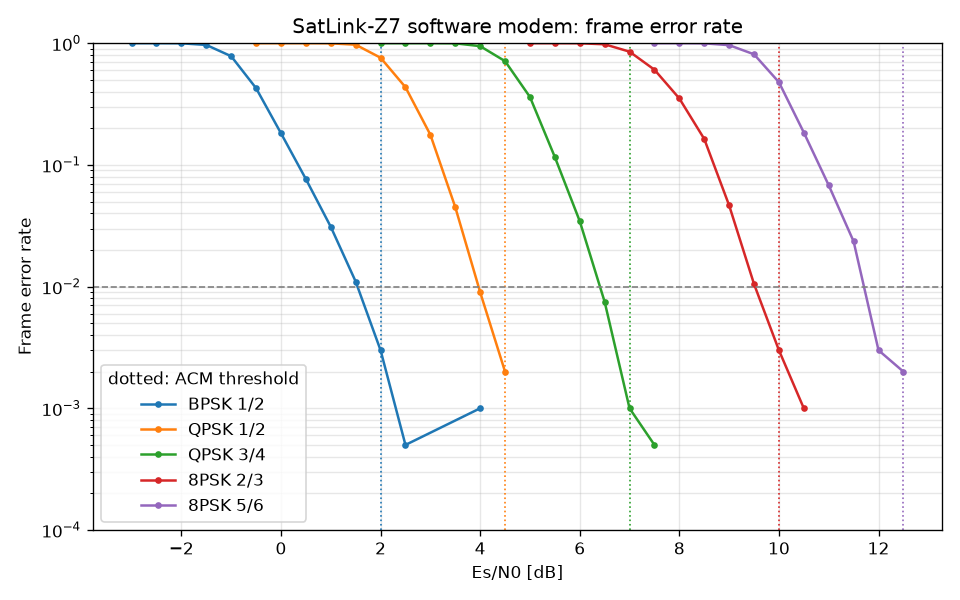
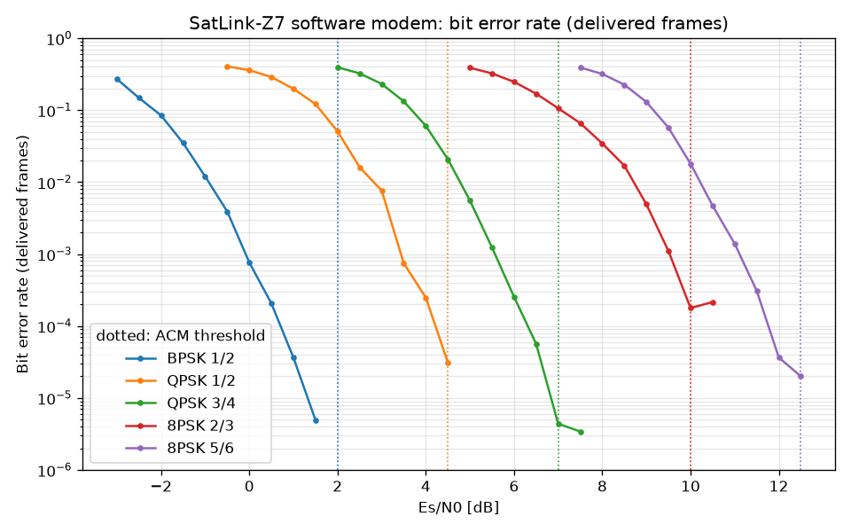
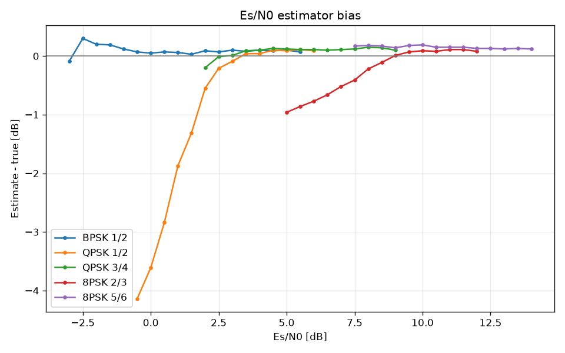

# Link performance

This page measures frame and bit error rates against Es/N0 for every MODCOD. The measurement runs
through the complete physical layer:

- CCSDS randomiser, CRC-16 and K=7 convolutional code
- Gray mapping, framing with ASM, header and pilots
- RRC pulse shaping at 2 samples per symbol
- AWGN channel with a carrier offset of 2·10⁻⁴ cycles per sample and a timing offset of 0.37
  samples
- matched filter, AGC, Gardner timing recovery, frame sync and carrier PLL
- max-log soft demapping and soft Viterbi decoding

The code under test is the modem library that the Core 1 firmware runs (`libs/modem`). This is
the same code, compiled for the host.

```bash
cmake --preset host-release && cmake --build --preset host-release
build/host-release/tools/perf/satlink-modem-perf --frames 2000 > docs/performance/modem_perf.csv
python3 tools/perf/plot_perf.py docs/performance/modem_perf.csv --out docs/performance --check
```

The CI job `performance` repeats the sweep with 500 frames per point on every push. It fails if an
ACM threshold drops below the measured requirement (SRS-PERF-001).

## Results

2000 frames of 128 bytes per point, steps of 0.5 dB ([modem_perf.csv](modem_perf.csv)).

| MODCOD | Info bits/symbol | Es/N0 for FER 1 % | ACM threshold | Margin | Shannon limit | Gap to Shannon | Net rate at 6 kBd |
|---|---|---|---|---|---|---|---|
| 0 BPSK 1/2 | 0.5 | 1.5 dB | 2.0 dB | +0.5 dB | -3.8 dB | 5.4 dB | 2.7 kbit/s |
| 1 QPSK 1/2 | 1.0 | 4.0 dB | 4.5 dB | +0.5 dB | 0.0 dB | 4.0 dB | 5.2 kbit/s |
| 2 QPSK 3/4 | 1.5 | 6.4 dB | 7.0 dB | +0.6 dB | 2.6 dB | 3.8 dB | 7.6 kbit/s |
| 3 8PSK 2/3 | 2.0 | 9.5 dB | 10.0 dB | +0.5 dB | 4.8 dB | 4.7 dB | 9.7 kbit/s |
| 4 8PSK 5/6 | 2.5 | 11.7 dB | 12.5 dB | +0.8 dB | 6.7 dB | 5.0 dB | 11.9 kbit/s |

The net rate is the information rate after framing, header, pilots, CRC and code tail, at the
6 kSym/s of the loopback. The rate scales with the symbol rate.





The BER figure counts the frames that the receiver delivered (CRC good or not). It therefore
shows the decoder. Frames that were never detected count only towards the FER.



## Findings

### 1. Carrier loop too wide: 2 dB lost on QPSK and 8PSK (fixed)

The first sweep put QPSK 1/2 at 6.5 dB for 1 % FER and 8PSK 2/3 at 12.5 dB, worse than 8PSK 5/6.
BPSK 1/2 was within 0.3 dB of the textbook value.

- **Cause.** The carrier PLL is decision-directed. With the old gains (Kp = 0.08, Ki = 0.002)
  its loop bandwidth was about 2 % of the symbol rate. At low Es/N0 the wrong decisions
  (detector self-noise) left a phase jitter of about 0.2 rad RMS.
- **Why QPSK and 8PSK.** BPSK barely notices 0.2 rad (cos 0.2 = 0.98). For QPSK and 8PSK the
  jitter rotates symbols towards the neighbouring decision regions.
- **Search.** A sweep of the gains, keeping damping at about 0.7:

  | Kp / Ki | QPSK 1/2 at FER ≤ 2 % | 8PSK 2/3 at FER ≤ 2 % |
  |---|---|---|
  | 0.08 / 0.002 (old) | 6 dB | 11.5 dB |
  | 0.04 / 0.0008 | 5 dB | 10.5 dB |
  | 0.02 / 0.0002 (new) | 4 dB | 9.5 dB |
  | 0.01 / 0.00005 | 4 dB | 9.5 dB |

- **Fix.** Kp = 0.02, Ki = 0.0002. This is the widest loop that reaches the floor, so it keeps
  tracking margin. With a carrier offset 15 times larger (3·10⁻³ cycles per sample, 0.6 % of
  the symbol rate) 8PSK 2/3 still reaches a FER of 2 % at 13.5 dB.
- **Consequence.** The ACM thresholds were derived again from the new curves: measured 1 % FER
  point plus at least 0.4 dB, rounded to 0.5 dB.

  | MODCOD | Old threshold | New threshold |
  |---|---|---|
  | BPSK 1/2 | 2.0 dB | 2.0 dB |
  | QPSK 1/2 | 5.0 dB | 4.5 dB |
  | QPSK 3/4 | 8.0 dB | 7.0 dB |
  | 8PSK 2/3 | 11.5 dB | 10.0 dB |
  | 8PSK 5/6 | 15.0 dB | 12.5 dB |

  During a pass the link now switches to 8PSK 5/6 at 12.5 dB instead of 15 dB (each plus the
  ACM margin). Between those two values it carries 11.9 instead of 9.7 kbit/s (+23 %). Between
  7 and 8 dB it runs QPSK 3/4 instead of QPSK 1/2 (+46 %).

### 2. The frame header limits BPSK 1/2 to a FER of about 10⁻³ (open)

Near its threshold, BPSK 1/2 loses about one frame in 1000 even when the payload would decode.
Examples: 6 of 2000 frames at 2 dB, 2 of 2000 at 4 dB. Every one of these frames is a header
error: the CRC-4 fails and the frame is dropped.

- **Cause.** The 16-bit header (MODCOD, type, sequence number, CRC-4) is protected only by
  4-fold repetition, which gives Eb/N0 = Es/N0 + 6 dB. At 2 dB that is 8 dB: a bit error rate
  of 2·10⁻⁴ and a header error rate of about 3·10⁻³. The K=7 code on the payload is much
  stronger at that point.
- **Impact.** The impact is small. It only matters at the bottom of the lowest MODCOD, that is
  right after AOS. There is no retransmission, so those frames are lost. The link counters
  (SID 2) show them.
- **Remedy (future frame format version).** Encode the 16 header bits with a stronger block
  code in the same 64 symbols. For example, a (64,16) extended BCH code or a first-order
  Reed-Muller code, as the DVB-S2 PLHEADER does. That gains about 3 dB on the header, without
  longer frames. It changes the frame format (ICD section 2) and the PL frame detector, so it is
  left for the second hardware revision.

### 3. Es/N0 estimator (as designed)

The estimate comes from the known symbols of each frame (ASM and pilots).

- **Accuracy.** Above each MODCOD's threshold it is within +0.2 dB.
- **Low Es/N0.** Below the threshold of QPSK and 8PSK it reads low: carrier slips turn the
  pilots into noise.
- **Effect on ACM.** A low reading only makes ACM step down sooner, which is the safe
  direction. The estimate never reads high where a wrong choice would cost frames.

### 4. Where the remaining gap to Shannon comes from

The measured gap is 3.8 to 5.4 dB. For a K=7 convolutional code without an outer code and with
128-byte frames, the expected gap is 4 to 5 dB. BPSK 1/2 looks larger only because BPSK uses
one dimension of the complex channel that the Shannon bound assumes. The next steps in coding
gain would be an outer Reed-Solomon code (about 2 dB, CCSDS 131.0) or an LDPC code in place of
the convolutional code. Either one is a change of the physical layer, not an implementation
fix.
