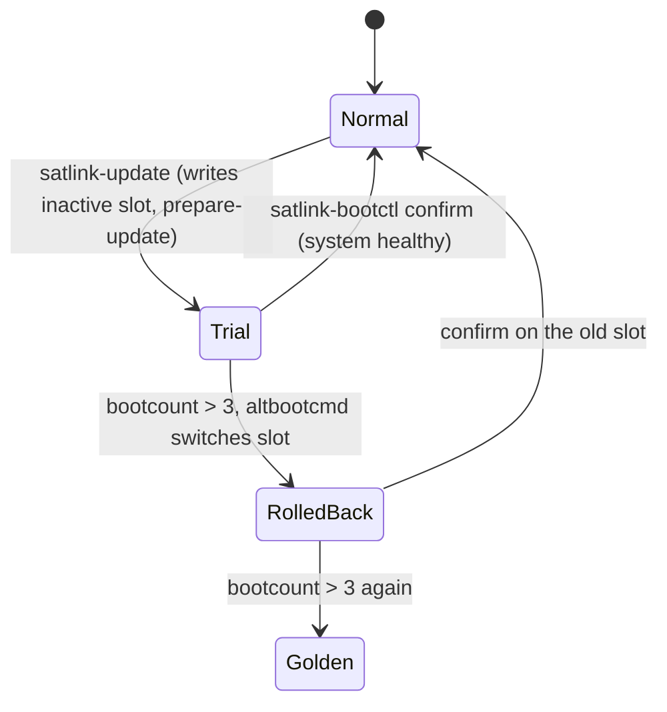

# Stage 3: Housekeeping controller, CAN bootloader, secure A/B boot

Goal: a third processor (MicroBlaze V in the PL) that looks after the board on its own and is
updated over CAN, and a boot chain that only runs signed kernels and survives a bad update.

## Exit criteria

| # | Criterion | Requirement | Status |
|---|---|---|---|
| 1 | Portable MCP2515 driver, tested against a register-level chip model | SRS-HKC-001 | done (10 tests) |
| 2 | Xilinx IP drivers (UART Lite, GPIO, Timer, INTC, Timebase WDT, Quad SPI, XADC), crt0 + trap vector, linker scripts | SRS-HKC-001 | done, cross-compiles (`hkc-riscv`) |
| 3 | CAN bootloader protocol: lost frames and responses tolerated, image verified before BOOT | SRS-HKC-002 | done (12 tests) |
| 4 | Housekeeping protocol (telemetry, commands, time sync) in one C library | SRS-HKC-003 | done (6 tests) |
| 5 | Image format + `tools/hkc/mkimage.py`, produced by the build | SRS-HKC-004 | done (7 C++ + 7 Python tests) |
| 6 | Housekeeping application logic (period, alarms, heartbeat, keyed bootloader entry) | SRS-HKC-005 | done (10 tests) |
| 7 | `satlink-hkc` on Linux (SocketCAN): monitor, commands, flasher with retries; loader service | SRS-HKC-006 | done (14 end-to-end tests against the real bootloader and app logic) |
| 8 | CRC-32 in `libs/common` | SRS-LIB-004 | done (4 tests) |
| 9 | Signed FIT only, A/B slots, boot counting, rollback | SRS-BOOT-002 | written; logic model + scenarios tested (13 tests); first Yocto build pending |
| 10 | Golden image on the SD card as last fallback | SRS-BOOT-003 | written; tested in the model; first Yocto build pending |
| 11 | On the board: bootloader in the bitstream, app loaded over CAN, update + rollback demonstrated | all | pending (needs the hw-v2 bitstream with the MicroBlaze V) |

## Housekeeping controller

```
bitstream (BRAM 0x0000)          Linux (can0 = PmodCAN #1)
+------------------+   CAN 500k  +---------------------------+
| HKC bootloader   | <---------> | satlink-hkc flash --boot  |  satlink-hkc-loader.service
|  canboot session |             |                           |
+--------+---------+             +---------------------------+
         | BOOT (image verified)
         v
+------------------+  0x100..0x102 every 1 s   +---------------------------+
| HKC application  | ------------------------> | satlink-hkc monitor       |
|  hkc_app logic   | <-- 0x180 commands ------ | satlink-hkc led/period/.. |
+------------------+  --> 0x181 ACK            +---------------------------+
```

- **Why a bootloader over CAN.** The MicroBlaze V executes from BRAM, which the bitstream
  initialises. Only the bootloader is baked in; the application comes from the Linux root file
  system, so it is versioned and updated with the A/B slot instead of requiring a new bitstream.
- **Robust download.** Each DATA frame carries a sequence number. A repeat of the last accepted
  frame (the host missed the ACK) is acknowledged again but not written, so lost responses never
  corrupt the image; `HkcClient` retries every request up to three times. The END step checks
  the transport CRC, then the image header, payload CRC, load address and entry point. START
  invalidates the old image, so a half-written one can never be booted.
- **Warm reset.** BRAM keeps its contents across a jump to the reset vector, so after a
  watchdog reset the bootloader finds the valid image and starts it after 2 s of silence.
  `enter-boot` sets a mailbox word (last 16 bytes of the bootloader window, never touched by
  either startup code) that keeps the bootloader waiting. The same mailbox passes the reset
  cause (power-on, watchdog, command) to the application, which reports it in telemetry.
- **Interrupts.** The application uses the AXI Timer (1 kHz tick) and the MCP2515 INT line
  through the AXI INTC into the RISC-V machine external interrupt; the main loop sleeps in
  `wfi`. The bootloader polls, so it has fewer ways to fail.
- **Everything with logic is portable.** `libs/hkc_proto`, `libs/mcp2515` and
  `firmware/hkc/app_logic` contain no register access and run in host tests; only
  `firmware/hkc/drivers` and the two `main.c` touch hardware.
- **No C library.** The images link with `-nostdlib`; `bsp/libc_min.c` provides the four
  `mem*` functions GCC may call. Bootloader: 6.2 KiB of 12 KiB, application: 6.5 KiB.

## Secure A/B boot

| Partition | Content |
|---|---|
| mmcblk0p1 (FAT) | `BOOT.BIN` (FSBL + bitstream + U-Boot with the FIT key), `uboot.env` |
| mmcblk0p2 / p3 | slot A / slot B: root file system with `/boot/fitImage` |
| mmcblk0p5 | golden image: read-only factory copy, never updated |
| mmcblk0p6 | `/data`, kept across updates |



- **Signed FIT only.** Kernel and device tree are one FIT image signed at build time
  (`kernel-fitimage`, `UBOOT_SIGN_ENABLE`); the public key is in U-Boot's device tree with
  `required = "conf"`. `CONFIG_LEGACY_IMAGE_FORMAT` and `bootz` are off, so nothing unsigned
  boots.
- **Tamper-resistant environment.** The boot logic lives in the built-in default environment
  (`satlink-env.txt`). `CONFIG_ENV_WRITEABLE_LIST` lets `uboot.env` on the FAT partition change
  only `boot_slot`, `bootcount`, `upgrade_available` and `rollback`, so editing the file cannot
  redirect `bootcmd`.
- **Health-gated confirmation.** `satlink-boot-ok.service` runs `satlink-bootctl confirm`,
  which ends a trial only if systemd reports `running`. Otherwise the service fails and
  `FailureAction=reboot` restarts the board, so U-Boot counts the attempt.
- **Model and tests.** `linux/bootctl` carries a model of the U-Boot logic
  (`PredictNextBoot`, also printed by `satlink-bootctl status`). The tests run complete
  scenarios (good update, bad update with rollback, both slots failing) through a simulation of
  `satlink-env.txt` and check the model predicts every boot; another test reads the real env
  file and checks the values the model assumes.
- **Stage 1 layout still available.** `SATLINK_SECURE_BOOT=0` builds the old image (zImage +
  boot.scr on FAT, one root partition) for first bring-up.

## To verify on the first build and on the board

- [ ] U-Boot accepts `satlink-ab.cfg` (Kconfig names for this u-boot-xlnx version) and finds
      `CONFIG_DEFAULT_ENV_FILE` relative to its source tree
- [ ] `kernel-image-fitimage` installs `/boot/fitImage` (symlink) in the root file system
- [ ] `u-boot-dtb.bin` carries the `/signature` node (`fdtget u-boot.dtb /signature`), and
      `satlink-ab.bif` boots it at 0x04000000
- [ ] wic creates p1..p6 as listed (p4 extended); `/boot/sd` and `/data` mount
- [ ] `fw_printenv` reads `/boot/sd/uboot.env` (`/etc/fw_env.config`)
- [ ] Update, forced failure (e.g. `systemctl mask` a unit so the system is degraded) and
      rollback demonstrated; golden image boots after two bad slots
- [ ] MicroBlaze V in hw-v2: `lmb_bootloader`/`lmb_app` sizes and peripheral addresses match
      `icd/address_map.yaml`; bootloader ELF associated with the MicroBlaze V in Vivado
- [ ] `satlink-hkc ping`, `flash`, `monitor` over PmodCAN #1 <-> #2; watchdog reset reported
      as `reset=watchdog`
- [ ] Bring-up report written from [docs/bringup/TEMPLATE.md](../bringup/TEMPLATE.md)
