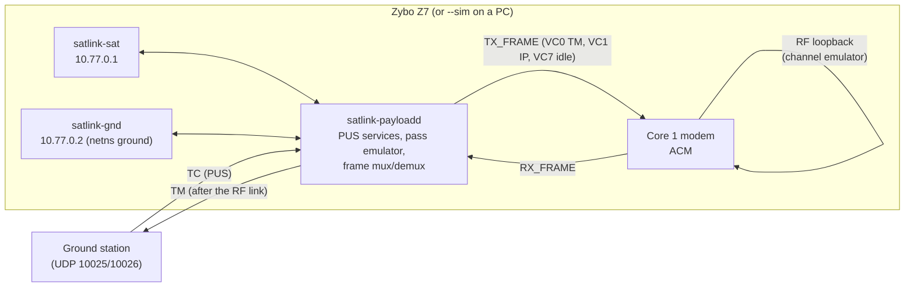

# Stage 5: Adaptive link and on-board networking

Goal: a payload that behaves like a flight payload towards its ground station (PUS services,
telemetry that only arrives when the link carries it) and a link that adapts to a satellite
passing overhead.

## Exit criteria

| # | Criterion | Requirement | Status |
|---|---|---|---|
| 1 | ACM controller in the firmware: margin, hysteresis, hold, lock-loss fallback, events | SRS-ACM-001, SRS-SYS-005 | done (8 tests incl. closed loop over the simulated link) |
| 2 | LEO pass model and emulation: elevation, range, range rate, Es/N0, AOS/LOS | SRS-ACM-002 | done (5 geometry tests + end-to-end pass) |
| 3 | Space packets with PUS-C headers, CUC time, CRC | SRS-PUS-001 | done (5 tests) |
| 4 | TM transfer frames, virtual channels, packet spanning, loss recovery | SRS-PUS-002 | done (8 tests) |
| 5 | ST[01], ST[03], ST[05], ST[08], ST[17] | SRS-PUS-003, SRS-SYS-003 | done |
| 6 | Telemetry only through the link; store and forward without contact | SRS-PLM-001 | done |
| 7 | Link control functions (MODCOD, ACM, channel, pass, loopback, modem restart) | SRS-PLM-002 | done |
| 8 | `satlink-payloadd`: UDP, AMP device or `--sim`, TUN, CAN; systemd unit | SRS-PLM-003 | done; runs on a Linux PC with `--sim`; board pending |
| 9 | IP over the RF link (TUN, network namespace) | SRS-NET-001 | done in simulation (8 end-to-end tests); `ping` on the board pending |

## How it fits together



- **Telemetry takes the RF path.** Every TM packet (verification, housekeeping, events) is
  framed, modulated, sent through the channel and demodulated before it goes to the ground.
  Fades and LOS affect the ground exactly as a real downlink would, and the link counters in
  SID 2 show what was lost.
- **Store and forward.** Without contact (no lock, or the pass model says the satellite is below
  the horizon) packets wait in the virtual channel queues; the modem keeps sending idle frames so
  the receiver can lock again, and the backlog is downlinked when contact returns. The "link
  lost" and "LOS" events are therefore always delivered, just late.
- **ACM runs where the frames are made.** The controller is part of the firmware's modem
  application and decides at every frame boundary from the receiver's Es/N0. With the loopback
  the receiver is on the same board; on a real link the Es/N0 would come back over the return
  channel, which only changes where the number comes from.
- **A pass in 25 seconds.** `START_PASS` with a time lapse replays a 10-minute pass: at 25x an
  80-degree pass steps the link from BPSK 1/2 at AOS to 8PSK 5/6 at culmination and back
  (see the test `LeoPassDrivesAcmFromAosToLos`).
- **IP over the link.** Two TUN interfaces, the ground side in its own network namespace, so the
  kernel cannot shortcut the traffic: `ip netns exec ground ping 10.77.0.1` crosses the modem
  twice per round trip. MTU 1000, APIDs 0x3F0 / 0x3F1 on VC 1.
- **Locked means frames get through.** The receiver's lock flag now requires a frame that passed
  its CRC; a channel that still lets headers through but breaks every payload counts as lost.

## Try it without a board

```bash
cmake --preset host-debug && cmake --build --preset host-debug
./build/host-debug/linux/payload/satlink-payloadd --sim --gs 127.0.0.1 --verbose
# Stage 6 adds the ground station GUI, the Rust CLI and the HIL test suite that talk to it.
```

## To verify on the board

- [ ] `satlink-payloadd` starts from systemd with `/dev/satlink-amp`, `--tun` and `--can can0`
- [ ] `satlink-net-setup up`; `ip netns exec ground ping 10.77.0.1` and `iperf3` across the link
- [ ] A pass with the software loopback, then (hw-v2) with the PL channel emulator: calibrate
      `noise_scale` so NOISE_LEVEL gives the modelled Es/N0
- [ ] HK SID 3 shows the housekeeping controller's temperature and supplies from CAN
- [ ] Bring-up report from [docs/bringup/TEMPLATE.md](../bringup/TEMPLATE.md)
