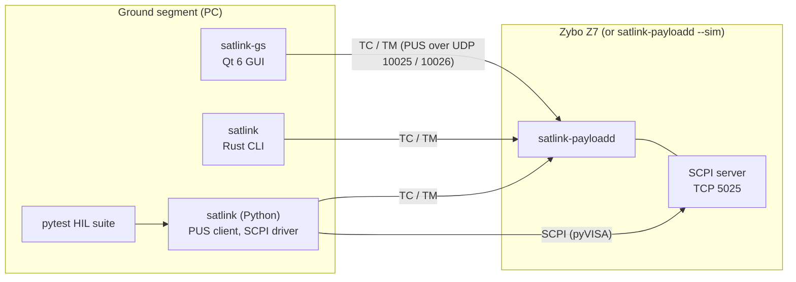

# Stage 6: Ground segment, instrument control, verification

Goal: run the payload the way a test lab and an operations team would. That means a ground
station for people, a CLI and a Python library for scripts, and a SCPI port for bench
automation. On top of that come an automated acceptance suite over the external interfaces, a
measured link budget, and the recovery chain for when things go wrong.

## Exit criteria

| # | Criterion | Requirement | Status |
|---|---|---|---|
| 1 | SCPI parser: short/long forms, optional nodes, compound messages, numeric keywords and units, error queue, IEEE 488.2 status registers | SRS-SCPI-001 | done (12 tests) |
| 2 | Payload SCPI command set on TCP 5025, in the `satlink-payloadd` poll loop | SRS-SCPI-002, SRS-SYS-004 | done (8 tests, plus the HIL suite over pyVISA) |
| 3 | Qt 6 ground station for Windows and Linux: all telecommands with verification tracking, housekeeping, event log, live Es/N0 / MODCOD / BER / elevation plots, constellation | SRS-GS-001 | done; protocol core checked against the flight code (4 tests); CI builds on both systems |
| 4 | Headless ground station (screenshot for docs and CI) | SRS-GS-002 | done (CI job) |
| 5 | Rust CLI without dependencies, exit status for scripts | SRS-GS-003 | done (13 tests incl. a fake payload over UDP) |
| 6 | Python library: PUS client, report decoders, SCPI through pyVISA or a socket | SRS-GS-004 | done (5 tests) |
| 7 | pytest HIL suite over PUS and SCPI, unchanged against `--sim` and the board | SRS-HIL-001 | done: 27 pass against the simulator; 4 board-only tests wait for hardware |
| 8 | Link performance report; ACM thresholds checked against measurement in CI | SRS-PERF-001 | done ([docs/performance](../performance/README.md)): found and fixed a 2 dB carrier-loop loss, thresholds lowered by up to 2.5 dB |
| 9 | FDIR chain: service watchdog, system watchdog, rollback | SRS-FDIR-001, SRS-FDIR-002 | done in software ([docs/fdir](../fdir/README.md)); sd_notify tested, watchdog and rollback on the board |

## How it fits together



- **Two control paths, two purposes.** PUS is the operational interface. Its telemetry comes
  down through the modem, so it is delayed, lost and stored exactly as a real downlink would
  make it. SCPI is the test-equipment interface. It answers immediately and sees the modem's
  own counters. The HIL suite uses both and checks that they agree, for example the Es/N0 in
  HK SID 1 against `MEAS:ESN0?`.
- **One control API.** The ST[08] functions and the SCPI commands call the same `PayloadManager`
  methods (`SetModcod`, `SetAcm`, `SetChannel`, `SetEsN0`, `StartPass`, ...), so the two paths
  cannot drift apart.
- **The ground station speaks the flight protocol.** Its core (`host/gs/core`) is compiled into
  the host unit tests against the real payload manager. Every telecommand it builds is accepted,
  and every report the payload sends is decoded. The standalone Qt build compiles the same PUS
  sources from `libs/pus`.
- **Constellation on request.** The firmware keeps 64 symbols of each received frame. The
  payload offers them as HK SID 4, off by default because at BPSK 1/2 it would use a third of
  the downlink. The ground station plots them over the ideal points of the current MODCOD
  (`satlink-gs --constellation`).
- **Measurements drive parameters.** The performance sweep runs the modem library, the same
  code the Core 1 firmware runs, through the complete physical layer. It showed the carrier loop
  was too wide: 2 dB lost on QPSK and 8PSK. After the fix, the ACM thresholds were set from the
  measured curves. CI repeats the sweep on every push and fails if a threshold falls below what
  the modem needs.


*The ground station during a 60° pass at 10× time lapse, against `satlink-payloadd --sim`:
ACM steps up from BPSK 1/2 to 8PSK 5/6 as the elevation rises. The constellation shows 8PSK at
14 dB.*

## Try it without a board

```bash
cmake --preset host-release && cmake --build --preset host-release
build/host-release/linux/payload/satlink-payloadd --sim --verbose &

# Ground station (Qt 6: qt6-base-dev, qt6-charts-dev)
cmake -S host/gs -B build/gs && cmake --build build/gs
build/gs/satlink-gs --pass --constellation

# CLI
(cd host/cli && cargo build --release)
host/cli/target/release/satlink ping
host/cli/target/release/satlink pass start --el 80 --scale 20
host/cli/target/release/satlink monitor --seconds 30

# SCPI from a terminal, or pyVISA: TCPIP0::127.0.0.1::5025::SOCKET
printf '*IDN?\nCHAN:ESN0 9;:MEAS:ESN0?\n' | nc -q1 localhost 5025

# HIL suite (starts its own simulated payload on free ports)
pip install -r host/hil/requirements.txt
pytest host/hil --target sim
```

## To verify on the board

- [ ] `pytest host/hil --target board --host <board>`: all 31 tests, including the PL loopbacks,
      the Core 1 restart and the housekeeping controller over CAN
- [ ] Performance over the analog loopback (3.5 mm cable, codec): repeat the SCPI sweep
      `CHAN:ESN0` / `MEAS:FER?` per MODCOD and compare with [docs/performance](../performance/README.md)
- [ ] RX latency (`MEAS:LAT?`) and Core 1 load with Linux under load (`stress-ng --cpu 1
      --vm 1`). This measures the cache and DDR interference that ADR-0003 leaves open.
- [ ] FDIR checklist in [docs/fdir](../fdir/README.md): service watchdog, SWDT reset, rollback
- [ ] Ground station on Windows against the board
